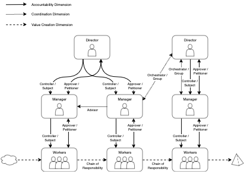

# Towards an Organisational Pattern Language

## Introduction

The intention of this work is to build a foundation for a pattern language we can use with organisations. The core
goals it tries to achieve are:

* to create a consistent way to reason about how organisations work
* to be able to communicate how an organisation works to others
* to work towards heuristics of the preferred patterns to use for certain organisational outcomes

Further reading:

* [The Organisational Problem Space](problem_space.md) defines some reasoning behind why organisational patterns could
  help us solve our problems
* [Definition of an Organisational Pattern](pattern_definition.md) defines what we expect an organisational pattern to
  actually contain for it to be useful

## Dimensions of Organisational Patterns

There are some repeated roles within organisations that everyone will recognise like a leader who collaborates with
others within their team, a manager of teams, or a person in a governance role overseeing others. What these roles have
in common is that they have **accountability** for something. These roles tend to define the formal structure of an
organisation. They will also often decide on the division of labour within the organisation, delegation of
responsibility for work onto others, and also manage the provision of rewards to those people.

Other roles we normally see in organisations are ones like programme management, strategy groups, and risk
management. Commonality between these roles is more about **coordination** of others. They define how the organisation
allocates tasks for people to complete, and manages the integration of effort once those tasks are done.

A third set of roles we see in organisations are things like cross-functional teams performing end-to-end delivery of
outputs, or a series of teams passing work along a chain to collectively deliver something, or one team making use of
the work of another. These are all roles of **value creation**, where the final result is a product or service. They
define the value streams within the organisation.

Together these three dimensions describe at a high level how an organisation operates. It could be argued that any
organisation where these three dimensions are not aligned will be less adaptable and resilient. For example highly
hierarchical organisations have a top-down structure of accountability and coordination, but normally the value creation
direction crosses these silos from side to side. Rearranging the organisation in value creation verticals would align
the three dimensions.

It is worth stating explicitly, that value creation roles are the only roles in the organisation that actually produce
anything. The other two dimensions should only exist to support the value creation roles, although this is often not
what happens in practice.

Some initial patterns are presented below for each dimension. Each pattern includes the constraints that need to be true
for the roles and relationships to work correctly. If these constraints are not met, then the pattern can break down and
not deliver the intended results.

## Organisational Patterns

### Patterns of Accountability

| Pattern                                 | Description                                                                                                                                                                                                                                                    |
|-----------------------------------------|----------------------------------------------------------------------------------------------------------------------------------------------------------------------------------------------------------------------------------------------------------------|
| [Approver](accountability/approver)     | The approver pattern creates centralised accountability for decision making. This pattern is a “pull” decision making model, where the petitioner requests decisions as needed.                                                                                |
| [Supervisor](accountability/supervisor) | The supervisor pattern creates centralised accountability for the work that a team performs. This pattern is a collaborative decision making model, where the decision maker is embedded in the team.                                                          |
| [Controller](accountability/controller) | The controller pattern centralised accountability for a task in one person. The subject that does the work is separate from the decision making. This pattern is a “push” decision making model, where the decision maker directs the activity of the subject. |
| Volunteer (proposal)                    | A person or group nominates themselves as accountable for a task. This is a social model, where the volunteer’s credibility is tied to their performance of the task.                                                                                          |
| Expert (proposal)                       | Accountability is assigned according to the expertise that each person or group in an organisation possesses. This is a skill based model, as only skilled people are able assume accountability for a task.                                                   |

### Patterns of Coordination

| Pattern                                   | Description                                                                                                                                                                |
|-------------------------------------------|----------------------------------------------------------------------------------------------------------------------------------------------------------------------------|
| [Orchestrator](coordination/orchestrator) | A role that is tasked with coordinating the work of others to achieve a common goal. This pattern is a synchronous coordination model.                                     |
| Advisor (proposal)                        | A group within the organisation that guides the direction of their followers by setting standards, strategy or guidelines. This pattern is a broadcast coordination model. |
| Workflow (proposal)                       | There is a common understanding of how work must be done, shared by all groups that need to contribute to the work. This pattern is a predefinition coordination model.    |

### Patterns of Value Creation

| Pattern                                                           | Description                                                                                                                                                      |
|-------------------------------------------------------------------|------------------------------------------------------------------------------------------------------------------------------------------------------------------|
| [Chain of Responsibility](value_creation/chain_of_responsibility) | Work being passed from one value creator to another along a defined path.                                                                                        |
| Service Provider (proposal)                                       | One service provider is responsible for delivering a defined organisational capability, that is then consumed by others.                                         |
| Decorator (proposal)                                              | An initial piece of work creates an output with some value, then this output is progressively improved by adding more value until the final outcome is achieved. |

## Patterns in Practice

Using the very basic language above to describe how organisations are put together, let's see what some worked examples
look like. Note that these examples are for the purpose of illustrating the model, and are not intended to be super
realistic.

The main method to show the effects of patterns on the behaviour within organisations is to describe how the patterns
affect the value streams. These patterns are probabilistic, so there are many different paths that value can take
through the organisation, being affected by different patterns, and to different degrees each time. The sum of all value
paths determines the total work that is done by the organisation.

### An Authority Hierarchy

An extremely common type of organisation is the authority hierarchy. This is an organisation with many levels where
people generally just do what their bosses tell them to do. These organisations are typically not very innovative, and
very slow to change. Common patterns we might find in these organisations are the Controller and Approver which
distribute accountability from the executive levels down through the hierarchy to the people who do the actual work,
creating a lot of silos in the process. Some Orchestrator patterns may exist, where programmes have been created to work
across the silos created by the accountability patterns. Value is generally created using a Chain of Responsibility
pattern which passes work from silo to silo. The accountability dimension in these organisation types is not aligned
with the value creation dimension, and there is not much of an orchestration dimension.

A good example of this type of organisation is the classic idea of a factory assembly line, where the work moves between
different people at each station, who perform their specific value adding task.

A diagram of how this might look is shown below, with patterns shown as dependency lines between people. From top to
bottom we see the authority hierarchy with solid lines, each person having multiple roles. The creation of value is
shown by the side to side dashed lines, transforming the input (cloud) into the output (pyramid). Any coordination
dependencies are shown as dotted lines between people.

From the diagram, we can pick out some salient points:

* Workers play the roles of Subject and Petitioner with their Managers, and they are part of a Chain of Responsibility
  that creates value.
* Managers play the roles of Subject and Petitioner towards their Directors, and also play the roles of Controller and
  Approver towards their Workers.
* Directors play the roles of Controller and Approver towards their Managers.
* One Director also plays the role of Orchestrator, but we can see that they will find it **much** easier to do this
  with one Manager then with the other, as they are only the Controller of one of them.
* This is a highly siloed organisation, with very few links across the hierarchy.
* Any global optimisation of the value stream must involve everyone on the diagram.