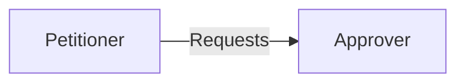

# Approver

The Approver pattern creates centralised accountability for decision making. Decisions take longer to be made, but the
Approver can be held accountable for organisational goals like consistency or quality. This pattern is a “pull” decision
model, where the Petitioner requests decisions as needed.

## Subjects

* **Approver** - the accountability holder for approving or denying the request
* **Petitioner** - the subject that requests the approval

## Constraints

For this pattern to work correctly, the following needs to be true:

* Influence
    * The Approver must have higher influence than the Petitioner to avoid being bypassed.
* Information
    * Enough information must flow between both parties for a quality approval decision to be made.
* Motivation
    * The Petitioner must be motivated to seek approvals.
    * The Approver to accept accountability for the decisions.

## Effects

Effect of this pattern on the organisation:

* Decisions can be more consistent, predictable and are transparent at the level of the Approver.
* Decisions will normally be made with summarised information, so may be lower quality.
* Capacity is wasted by creating a dependency and waiting for approvals, so fewer decisions are made, and fewer actions are performed. This is especially the case for nested approval structures.
* Creates a formal process that increases organisational inertia.
* Major changes do not need to be pushed out to each individual Petitioner, as the Approver pattern establishes a pull model for decisions.
