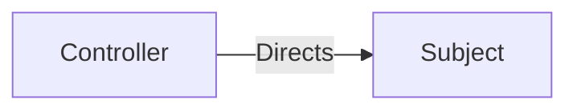

# Controller

The Controller pattern centralised accountability for a task in one person. The Subject that does the work is separate
from the decision maker. This pattern is a “push” decision model, where the decision maker directs the activity of the
Subject.

## Subjects

* **Controller** - the accountability holder for the action or decision
* **Subject** - the more passive subject that is directed by the Controller

## Constraints

For this pattern to work correctly, the following needs to be true:

* Influence
    * The Controller must have higher influence than the Subject, to avoid being ignored.
    * There is limited scope for feedback from the Subject back to the Controller due to the difference in level of
      influence.
* Information
    * Information flow is mostly one directional from the Controller to the subject.
    * Any information flowing to the Controller must be summarised to reduce their cognitive load.
    * Cognitive load will limit how many Subjects a Controller can direct.
* Motivation
    * The Controller must be motivated to direct the Subject and do nothing else, and the Subject must trust the
      Controller to make good quality decisions.

## Effects

Effect of this pattern on the organisation:

* Decisions can be more consistent.
* Decisions will be made with summarised information, so may be lower quality.
* Reduces the number of communication links needed.
* The Subject has much less autonomy.
* Adds a large amount of organisational inertia, as changing this relationship is difficult.
* Lack of feedback means the subject cannot contribute to incremental improvements.
* Capacity is used up waiting for decisions, or in making decisions for others, so fewer actions will be taken.
