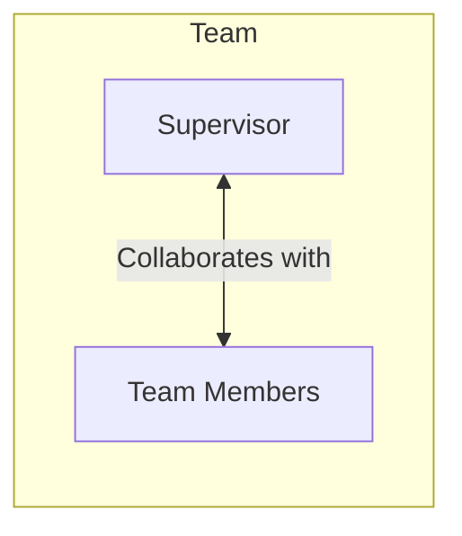

# Supervisor

The Supervisor pattern creates centralised accountability for the work that a Team performs. The Team has less control
over what they do, but the Supervisor can be held accountable for the work outputs of the Team meeting organisational
goals. This pattern is a collaborative decision model, where the decision maker is embedded in the Team.

## Subjects

* **Supervisor** - the accountability holder for the outputs of the Team
* **Team** - the people who assist the Supervisor to meet the Team's goals

## Constraints

For this pattern to work correctly, the following needs to be true:

* Information
    * Constant information must flow between Supervisor and Team.
* Expertise
  * The Supervisor must have enough domain expertise to maintain credibility with the Team and be able to collaborate.
* Motivation
    * The Supervisor must be motivated to lead the Team and spend most of their time collaborating.
    * The Team must trust the Supervisor.

## Effects

Effect of this pattern on the organisation:

* Decisions can be more consistent.
* Single point of contact for the Team reduces the number of communication links needed.
* Can be used to improve the quality of decisions and actions performed by the Team.
* Formalises a position that often occurs naturally.
