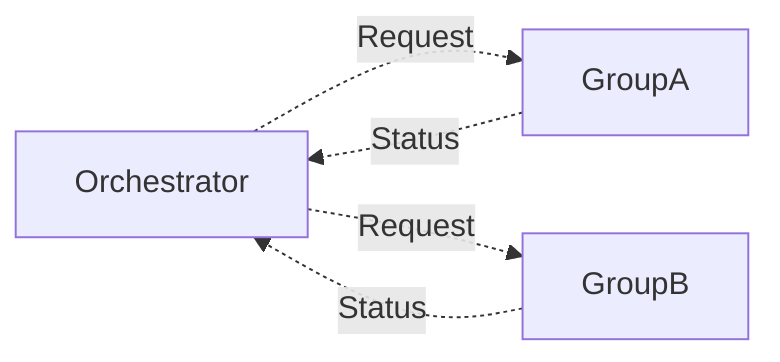

# Orchestrator

A role that is tasked with coordinating the work of others to achieve a common goal. This pattern is a synchronous
coordination model.

## Subjects

* **Orchestrator** - the role coordinating the actions of multiple Groups
* **Group** - the role that is responsible for performing the activities being coordinated

## Constraints

For this pattern to work correctly, the following needs to be true:

* Information
  * The Orchestrator must continually request status updates from the Groups.
  * Group status updates must be summarised to avoid overflowing the Orchestrator's cognitive load.
* Expertise
  * The Orchestrator must have expertise in managing and sequencing tasks to work towards a goal.
* Motivation
  * The Orchestrator must be motivated to manage the process.
  * The Groups must be motivated to provide status updates to the Orchestrator.
  * The Groups must be motivated to perform tasks to progress towards the goal.

## Effects

Effect of this pattern on the organisation:

* Decomposes the value generating work and combines the efforts of multiple Groups.
* Support the organisation creating more complicated outputs beyond the abilities of just one Group.
* The Orchestrator becomes a single point of understanding of the value being created.
* Waste is created by adding dependencies and communication overheads between the Orchestrator and the Groups.
* Increased organisational inertia, as Groups cannot create value without the Orchestrator, and all parties must adapt
  to any change.
* The Orchestrator is a central place where the state of progress towards the goal is stored.
