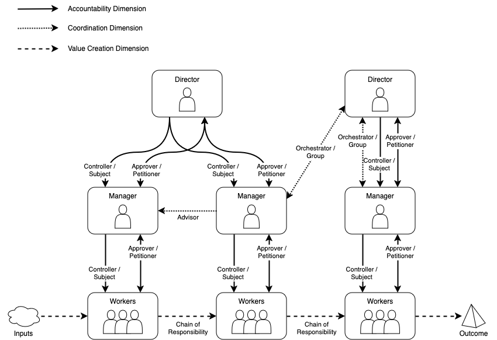

# Authority Hierarchy

An extremely common type of organisation is the authority hierarchy. This is an organisation with many levels where
people generally just do what their bosses tell them to do. These organisations are typically not very innovative, and
very slow to change. Common patterns we might find in these organisations are the Controller and Approver which
distribute accountability from the executive levels down through the hierarchy to the people who do the actual work,
creating a lot of silos in the process. Some Orchestrator patterns may exist, where programmes have been created to work
across the silos created by the accountability patterns. Value is generally created using a Chain of Responsibility
pattern which passes work from silo to silo. The accountability dimension in these organisation types is not aligned
with the value creation dimension, and there is not much of an orchestration dimension.

A good example of this type of organisation is the classic idea of a factory assembly line, where the work moves between
different people at each station, who perform their specific value adding task.

A diagram of how this might look is shown below, with patterns shown as dependency lines between people. From top to
bottom we see the authority hierarchy with solid lines, each person having multiple roles. The creation of value is
shown by the side to side dashed lines, transforming the input (cloud) into the output (pyramid). Any coordination
dependencies are shown as dotted lines between people.

From the diagram, we can pick out some salient points:

* Workers play the roles of Subject and Petitioner with their Managers, and they are part of a Chain of Responsibility
  that creates value.
* Managers play the roles of Subject and Petitioner towards their Directors, and also play the roles of Controller and
  Approver towards their Workers.
* Directors play the roles of Controller and Approver towards their Managers.
* One Director also plays the role of Orchestrator, but we can see that they will find it **much** easier to do this
  with one Manager then with the other, as they are only the Controller of one of them.
* This is a highly siloed organisation, with very few links across the hierarchy.
* Any global optimisation of the value stream must involve everyone on the diagram.
