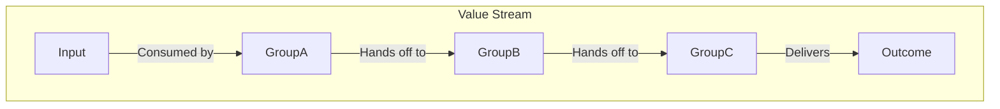

# Chain of Responsibility

Work being passed from one value creator to another along a defined path.

## Subjects

* **Group** - the role that performs value generating activities

## Constraints

For this pattern to work correctly, the following needs to be true:

* Influence
  * Someone outside the chain with a high level of influence must decide to create it.
* Motivation
  * Each Group must be motivated to complete their section of the chain.
* Purpose
  * Each Group must trust that their work has a purpose, even though they see only a small part of it.
* Expertise
  * Each Group must have the expertise to complete their assigned activities.
* Dependencies
  * The value generating work must be decomposed into a series of steps.
  * Each Group must accept work from the preceding Group in the chain.
  * Each Group must pass work to the next Group in the chain.

## Effects

Effect of this pattern on the organisation:

* No single point of understanding of the value being created, as knowledge is distributed along the chain.
* Waste is created by adding dependencies, wait times, queuing and handoffs. This waste increases with the number of Groups in the chain.
* Massively increased organisational inertia, as Groups not only cannot create value by themselves, they must remain in the defined sequence to generate any value at all. Any change must first evaluate the whole chain, then make changes to the sequence.
* Efficiency gains from local specialisation can be achieved, as each Group refines their activity. This is achieved at the expense of global optimisation.
* High upfront cost to set up, and not efficient for highly variable outputs as the cost of change is prohibitive.
* Highly susceptible to error cascades.
* Can enable the organisation to produce massively complicated outcomes, at the expense of flexibility.
